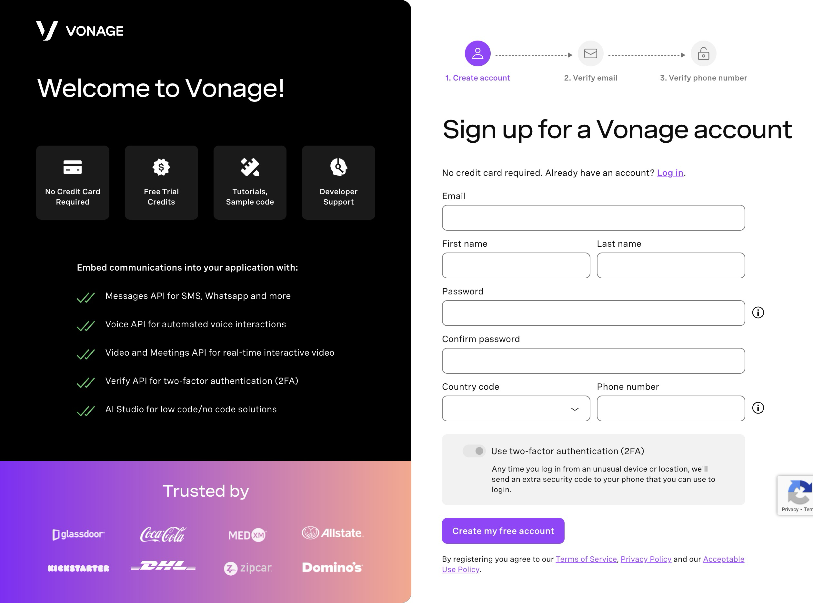

# Real-Time WhatsApp Support Chat Application with Couchbase and Vonage


[](/LICENSE)


<p align="center">
    
</p>

This is a real-time support WhatsApp chat application built with Couchbase and Vonage. The application allows users to ask support questions of support agents in real time using WhatsApp. Agents are then given suggested answers using Couchbase vector search from the database of previous support tickets to provide support to the current user.

## Table of Contents
- [Features](#features)
- [Setting Up Vonage Messages API](#setting-up-vonage-messages-api)
  - [Create a Vonage Account](#create-a-vonage-account)
  - [Configure the Vonage Messages API Sandbox](#configure-the-vonage-messages-api-sandbox)
  - [Set Up Environment Variables](#set-up-environment-variables)  
- [Setting Up Couchbase Capella](#setting-up-couchbase-capella)
  - [Create a Couchbase Capella Account](#create-a-couchbase-capella-account)
  - [Create a Cluster and Bucket](#create-a-cluster-and-bucket)
  - [Set Up Couchbase Connection String and Credentials](#set-up-couchbase-connection-string-and-credentials)
- [Installation](#installation)
- [Running the Application](#running-the-application)
  - [Using ngrok](#using-ngrok)
- [Usage](#usage)
- [License](#license)

## Features

- Real-time messaging using the [Vonage Messages API](https://www.vonage.com/communications-apis/messages/)
- Support for multiple users and agents
- Messages stored in [Couchbase Capella](https://cloud.couchbase.com/)
- Vector search for relevant support ticket information from the Couchbase database
- Simple, elegant UI with Tailwind CSS

## Setting Up Vonage Messages API

### Create a Vonage Account

If you don't already have a Vonage account, you can create one [here](https://dashboard.vonage.com/sign-up).



Once you have your Vonage account, the easiest way to immediately start exploring the Messages API is to use the [Vonage Messages API Sandbox](https://dashboard.nexmo.com/messages/sandbox).

### Configure the Vonage Messages API Sandbox

The Sandbox is excellent for testing and prototyping your application. It allows you to send and receive messages from a preconfigured Vonage phone number and an approved personal phone number.

To configure the Vonage Messages API Sandbox, you will need to send a message to the preconfigured Vonage phone number provided. The dashboard will guide you through the process by providing a QR code, a link and a direct phone number to send a message to. It will also share the exact message to send to the number. You can choose to use any of the methods to send the message.

Once you send the message, you will have successfully configured your personal phone number to receive and reply to messages from the Vonage Messages API Sandbox.


You will notice the space in the sandbox setup to provide URLs for both Inbound and Status webhook messages. You will provide your ngrok URL here once you have set up ngrok, which we will cover in the [Using ngrok](#using-ngrok) section.

At this point, you are ready to set up your Couchbase Capella account and create your Couchbase cluster and bucket to hold your support ticket and user data.

### Set Up Environment Variables

Copy the `.env.sample` file in the root of the project to `.env` and set the required environment variables. You can find your Vonage API key and secret on the Vonage dashboard. You can set the `VONAGE_FROM_NUMBER` to the Vonage phone number provided in the Vonage Messages API Sandbox.

```bash
VONAGE_API_KEY=your_vonage_api_key
VONAGE_API_SECRET=your_vonage_api_secret
VONAGE_FROM_NUMBER=your_vonage_from_number
```

## Setting Up Couchbase Capella

### Create a Couchbase Capella Account

Couchbase Capella is a fully managed cloud database service for adaptive data. You can use it for a variety of use cases, including real-time analytics, cache, full text and vector search, and a lot more.

It is free to create a Couchbase Capella account and you can do so [here](https://cloud.couchbase.com/). 


Once you have created your account, you can create a new cluster and bucket to store your support ticket and user data.

### Create a Cluster and Bucket

In Couchbase terminology, a cluster is the equivalent to a database server, whereas a bucket is the equivalent to a database. You can create a new cluster and bucket by clicking on the "Create Cluster" button on the Couchbase Capella dashboard.

Capella supports working with a multi-cloud environment and you can choose to work with AWS, Azure, or GCP. As you configure your new cluster you can choose the cloud provider you prefer among other configurations.


Once you have created your cluster, you can create a new bucket by clicking on the "Create Bucket" button on the cluster dashboard. You can configure the bucket with the name you prefer and the size you need.


### Set Up Couchbase Connection String and Credentials

Once you have created your cluster and bucket, you can find the connection string and credentials on the cluster dashboard. You will need these to set up your environment variables in the `.env` file in the root of the project. If this is a new Couchbase account, you will need to create your own username and password for the first time. Follow the instructions on the dashboard to do so.


Copy the `.env.sample` file in the root of the project to `.env` and set the required environment variables. If you have done so already in the Vonage Messages API setup, you can add the following environment variables to the `.env` file:

```bash
COUCHBASE_CONNECTION_STRING=your_couchbase_connection_string
COUCHBASE_BUCKET=your_couchbase_bucket
COUCHBASE_USERNAME=your_couchbase_username
COUCHBASE_PASSWORD=your_couchbase_password
```

## Installation

1. **Clone the Repository**
   ```bash
   git clone https://github.com/hummusonrails/whatsapp_support_app.git
   cd whatsapp_support_app
    ```

2. **Install Dependencies**
   ```bash
    bundle install
   ```

3. **Set Environment Variables**
    Copy the `.env.example` file in the root of the project to `.env` and set the required environment variables, if you have not done so earlier. You can find your Vonage API key and secret on the Vonage dashboard. You can set the `VONAGE_FROM_NUMBER` to the Vonage phone number provided in the Vonage Messages API Sandbox. You can also set the Couchbase connection string and credentials here. The OpenAI API key can be found on the OpenAI dashboard.

    ```bash
    VONAGE_API_KEY=your_vonage_api_key
    VONAGE_API_SECRET=your_vonage_api_secret
    COUCHBASE_CONNECTION_STRING=your_couchbase_connection_string
    COUCHBASE_BUCKET=your_couchbase_bucket
    COUCHBASE_USERNAME=your_couchbase_username
    COUCHBASE_PASSWORD=your_couchbase_password
    OPENAI_API_KEY=your_openai_api_key
    ```

## Running the Application

1. Start the Rails Dev Server
    ```bash
    bundle exec bin/dev
    ```

2. Start the [ngrok](https://ngrok.com/) tunnel in a separate terminal window (used to send and receive messages from WhatsApp and Vonage webhook updates)
    ```bash
    ngrok http 3000
    ```

### Using ngrok

If you have never used ngrok before and unfamiliar with what it is, here is a brief overview. ngrok is a tool that allows you to expose a local server to the internet. This is useful when you are working on a local server and need to receive webhook updates from an external service like Vonage. The Vonage documentation has a [great guide](https://developer.vonage.com/en/getting-started/tools/ngrok) on ngrok and how to use it. 

The simple bit is to install [ngrok](https://ngrok.com/) and run the command `ngrok http 3000` in a separate terminal window. This will expose your local server to the internet and provide you with a URL you can use to set up your Vonage Messages API Sandbox webhook URLs.

## Usage

Open your browser and navigate to http://localhost:3000. You should see the application's home page. As support queries come in from WhatsApp, they will populate the table on the home page. Agents can then click on a query to view suggested answers from the Couchbase database and interact with the user in real time. 

Once the query has been answered, the agent can mark it as resolved. When an agent marks and saves an answer as resolved, it initiates a call to the OpenAI Embeddings API to store the answer in both plaintext and as a vector in the Couchbase database. This allows the application to perform a vector search on the database to provide suggested answers to agents in real time on future queries.

## License

This project is licensed under the MIT License. See the [LICENSE](LICENSE) file for details.

